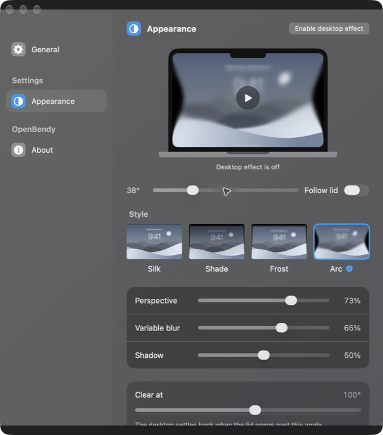

# OpenBendy

Your desktop bends as you close your MacBook lid.

A native macOS app built with SwiftUI, AppKit, ScreenCaptureKit, IOKit HID, and Metal.
No web view, accounts, third-party packages, or remote services.

[openbendy.com](https://openbendy.com)



## Features

- Live lid tracking with a fold anchored at the screen hinge.
- Progressive blur, soft edges, and adjustable perspective and shadow.
- Silk, Shade, Frost, and Arc styles.
- Arc curves the sides inward while keeping the desktop at full height, with softer upper content and sharp outer top and bottom edges.
- Interactive preview with manual angle control or live lid tracking.
- Menu bar controls and Esc to pause the desktop effect.
- Original SVG icons in `Brand/`.

## Download

Download **OpenBendy-macOS-universal.zip** from the [latest release](https://github.com/yunuscode/openbendy/releases/latest),
extract it, and move `OpenBendy.app` to Applications.

Requires macOS 14 or later. The binary includes Apple silicon and Intel architectures;
live lid tracking has been verified on an M3 Pro MacBook Pro only.

The current release is **Developer ID signed and notarized by Apple**, with the
notarization ticket attached for offline verification. Gatekeeper assessment passes.
If you downloaded the earlier build, replace it with a fresh download from the release.
You can also build locally using the instructions below.

## Build and run

Open `OpenBendy.xcodeproj` in Xcode 26 or later, select the OpenBendy scheme, and Run.
The app targets macOS 14 or later. Live lid tracking requires a MacBook with a compatible lid-angle sensor.

Or build from the terminal:

```sh
./build.sh
```

The script prints the built app's location. Build products use a temporary directory
outside the source folder. Set `OPENBENDY_BUILD_DIR` to override it, or
`OPENBENDY_SIGNING_IDENTITY` to use your own signing identity. The project defaults
to local ad-hoc signing with sandboxing disabled for HID access.

The checked-in Xcode project is ready to build. If editing `project.yml`, regenerate
it with `xcodegen generate`.

## Enable the desktop effect

1. Open General → Allow Screen Recording.
2. Enable OpenBendy in System Settings → Privacy & Security → Screen & System Audio Recording.
3. Relaunch if macOS requests it, then select Enable desktop effect.
4. Lower your MacBook lid below the configured Clear at angle.

Screen frames stay in memory on your Mac. Capture excludes OpenBendy's own windows
and does not capture audio. The built-in display is selected when available.
The Appearance slider and Follow lid switch control the preview; the live desktop
effect follows the hardware sensor.

Pause from the menu bar or press Esc. The effect pauses on sleep or display
reconfiguration; enable it again afterward.

## Tests

```sh
./build.sh test
```

Nine XCTest cases cover preferences, continuous effect progress, real Metal output,
soft edges, early blur, hinge detail, resolution consistency, Arc geometry and diffusion, and preview texture upload.
See [QA.md](QA.md) for verification details and remaining device checks.

## Source map

- `SettingsView.swift`: Appearance, General, and About.
- `Landscape.swift`: SwiftUI scenery and the interactive Metal preview.
- `Preferences.swift`: saved settings and preview state.
- `LidSensor.swift`: background HID feature reads and sensor callbacks.
- `DesktopEffect.swift`: screen capture and click-through overlay.
- `DesktopRenderer.swift` / `Bend.metal`: projection, blur, shading, and rendering.
- `EscapeShortcut.swift`: the global pause shortcut.

The `local.yunus.lidfx` bundle identifier is retained for existing installations'
Screen Recording permission continuity.
